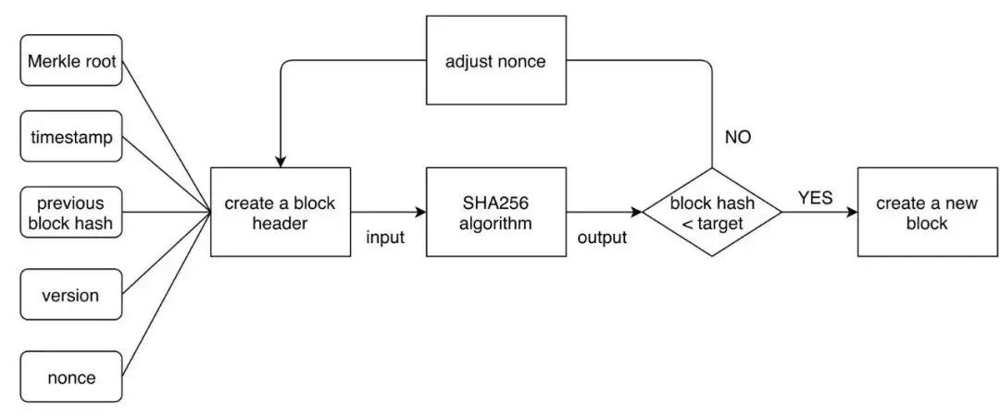

# 区块链入门教程06：什么是PoW、PoS

共识机制是区块链系统中一个非常重要的概念。它提供了在无法信任的分布式节点网络中,对交易的验证和数据一致性达成共识的方法。简单来说,共识机制是让网络中的节点就区块的确认达成一致,从而保证全网的数据与状态同步的规则。区块链的价值在于它是“去中心化”的,共识机制保证了区块链系统的安全稳定运行。 我们今天介绍两种主流区块链共识机制:

## 一、PoW --（Proof of Work）工作量证明

PoW是是在区块链网络上达成一致，从而确认交易并为区块链生成新区块的一种共识机制，比特币就是采用PoW共识机制来确保账本的一致性和不可篡改性。

### 什么是PoW
POW要求参与记账的节点通过解决复杂的计算问题来证明其完成了工作,从而获得记账权和系统奖励。PoW模式可以简单理解为：所有网络节点计算同一个数学题目，谁先算出来，谁就拥有记账权，并且能够得到相应的记账报酬（例如：比特币）。 1993年，两位密码学先驱Cynthia Dwork和Moni Naor在一篇学术论文中最早提出了PoW的概念。一开始，这个技术是被用来解决垃圾邮件的问题（系统要求发送者，每发送一封邮件，都要做一定的工作量证明行为，从而提高大量发送垃圾邮件的成本）。2008年，中本聪选定PoW为比特币的共识机制，随着区块链行业的发展，PoW机制的优势有目共睹。现如今，PoW已成为了区块链领域的主流共识机制。 中本聪在比特币白皮书中的这样描述PoW： _“工作量证明还解决了在多数决策中如何确定代表的问题。如果基于一个 IP 地址一票的方式选出多数，那么任何能够分配多个 IP 的人都可以破坏投票。工作量证明本质上是一个 CPU 一票。为工作量证明投入最多的将成为最长的链，也将成为多数决策的代表。如果大部分 CPU 算力由诚实节点控制，那么诚实链的增长也会最快，远超任何与之竞争的链。”_

### PoW如何工作
为了使区块链交易结果在一定时间内达成一致（达成共识），PoW机制要求所有网络节点参与一场争夺记账权和区块奖励的竞赛。在PoW机制中，所有的“工作”都是计算，算力在PoW机制起着决定性作用。 PoW机制的运算过程没有捷径可走，唯一的解决方法便是增加算力，以不停猜测的方式一次次尝试，最终试出唯一的正确答案。一旦得出正确结果，这一结果便能以广播的方式迅速被所有网络节点验算，此区块上的交易也被整个网络验证。接下来，整个网络又进入下一轮记账竞争中。这一过程称也被称作“挖矿”。 PoW工作流程如下图：

虽然每轮记账竞赛只有一个节点能够获得计算奖励（例如：比特比)，由于每轮计算之间彼此独立，最终的记账权和奖励之争演化为了单纯的算力之争。一个节点所控制的算力规模越大，获得奖励也就越多。而所有节点耗用的时间、设备与电力，则成为保障区块链网络安全的成本，整个网络的节点数目越多、消耗的能源越多，区块链网络的安全性也越好。 PoW机制的设计简明且优美，使用PoW机制的比特币也是理论上具有最高去中心化程度的加密货币。没有它，比特币网络就无法运转。

### PoW的优点：
1. 去中心化程度高，不需要中心化监管。
2. 安全性高，攻击者想要篡改区块链的信息或控制整个系统，必须投入超过整个网络一半的计算能力（51%的算力攻击）。考虑到目前的算力总规模，这种攻击几乎是不可能发生的。

### PoW的缺点：
1. 高耗能。由于各个节点之间只依靠算力进行竞争，大量计算单元在执行PoW机制时对于能源消耗量十分巨大。
2. 低效率。PoW确认速度慢、吞吐量低。由于PoW机制所设置的问题难度较高，比特币出块时间为10分钟左右，这意味着一笔交易需要长达1个小时（约6个区块后），才能在比特币网络上真正被确认。而比特币网络的TPS仅为7，即每秒只能处理7笔交易。

### 要点总结
- **PoW的基本原理**:
1. 矿工需要通过哈希计算来找到一个随机数nonce,使得块头哈希值小于难度目标。
2. 找到这个符合要求的nonce需要暴力枚举,因此需要进行大量计算,这就构成了“工作量证明”。
3. 第一个计算出valid nonce的矿工就可以获得该区块的挖矿奖励。
4. 随着矿工竞争增加,难度目标会自动调整更高,以保证平均10分钟生成一个新区块。
5. 通过工作量证明,可以避免双花攻击,因为反向计算难度极大。
6. 工作量证明依靠算力竞争和耗电来构建去中心化共识。
7. PoW机制存在资源浪费问题。
8. POW使参与维护账本需要进行可验证的高难度计算,以实现去中心化、防止作恶。
- **极简PoW**:
1. 许多人都想记账,但只能一个人记。
2. 所以大家开始做难题,最先算出来的人可以记账。
3. 难题越难算,就需要越多电脑来加速。
4. 算出来的人可以获取奖励。
5. 下次继续做新难题,重复这个过程。
6. 做难题需要消耗电,但可以保证记账公平。
7. 算力越强的人,记录账本的机会越大。
8. 通过让大家做难题计算,就可以公平选择记账人,这就是工作量证明机制的基本思想。

## 二、POS --（Proof of Stake）权益证明

**持有量证明**（英语：**Proof of Stake**或**POS**），又称**权益证明**，是加密货币中共识机制的一种。 通过权益大小形成共识 。

### 前言

权益证明 (PoS) 是一种区块链的共识机制，区块链使用这些机制来实现分布式共识。权益证明 (PoS) 的参与者可以质押少量该区块链网络的代币成为节点，依据质押代币数量的多少，将有机会成为验证者来验证交易并获得区块奖励。权益证明通过要求验证者质押一定数量的代币以实现安全交易，它解决了工作量证明 (PoW) 需要消耗大量能源的问题。

## 什么是 PoS
在 2011 年的 Bitcointalk 论坛上，QuantumMechanic 的成员率先提出了权益证明 (PoS) 共识机制。在权益证明 (PoS) 中，“验证者”需要质押一部分加密货币，质押数量越多的节点有越高机会获得新区块的记帐权和区块奖励。为了避免抵押金额高的验证人成为创建新区块的固定节点，挑选验证人的算法通常都会包含其他的参数，如质押代币数量、代币年龄、随机区块选取等，确保不会由固定的节点创建新区块。代币年龄指的是验证人质押代币后间隔多久时间尚未创建新区块，代币年龄越大的验证人，创建新区块的机率越高。设置代币年龄的机制，可以让质押数量较少的节点也有机会创建新区块从而获得奖励。 权益证明 (PoS) 的运作流程大致如下：
1. 节点间执行尚未被验证的交易，区块链网络将这些待验证的交易放在一个池子里，等待质押加密货币的验证人处理。
2. 算法根据一些参数，比如质押代币数量、代币年龄、随机区块选取等，挑选出一个验证人创建新区块。
3. 被选中的验证人确认待验证的交易后，创建新区块并打包这些交易记录。
4. 其他未被选中的节点确认新区块的内容是否正确。
5. 如果新区块中的交易记录被其他节点确认无误，就将新的区块添加至区块链网络中。反之，若新区块中的交易纪录有异常，则拒绝添加新的区块。
6. 新的区块被添加时，验证人可以取回质押的代币并获得该区块奖励。反之，若新的区块被拒绝添加，验证人可能会遭到削减质押代币的惩罚

## PoS 的安全性
使用权益证明共识的区块链网络也面临被51%攻击的可能性，如果能取得51%质押代币，就能取得该区块链控制权，伪造交易记录。然而收购51%的代币是不切实际的，大量求购代币将导致代币价格暴涨。发起攻击后，区块链网络会受到影响，使用者恐慌抛售会造成代币价格暴跌。收购代币的成本会远大于从攻击中获得的代币价值。又加之许多采用权益证明的区块链网络引入了惩罚机制， 虚假的区块和交易记录若被其他验证人发现，发起攻击的节点会损失部分甚至是全部的质押代币，因此采用权益证明的区块链在安全性方面没有太多的问题，尤其是市值较高的加密货币，几乎不可能发生51%攻击。

## PoS 的优点
权益证明 (PoS) 被大家认为是比工作量证明 (PoW) 更为优秀的共识机制，主要在于其以下优点：
1. 能效更高 – 无需在工作量证明计算中使用大量能源；
2. 门槛更低、硬件要求下降 – 无需购买高性能硬件以便获得创建新区块的机会；
3. 中心化风险降低 – 权益证明应该可以增加保护网络安全的节点；
4. 由于能源需求低，发行较少的区块链代币就可以激励大家参与；
5. 与工作量证明相比，对不当行为的经济处罚让 51% 攻击的代价呈指数级增加；
6. 如果 51% 攻击是为了攻破加密经济的防御，那么社区可以求助于诚实链的社会恢复。

### 要点总结
PoS(Proof of Stake)是另一种更环保的共识机制。它依靠节点“抵押”代币而非算力来保障系统安全。

**PoS工作流程：**
1. 抵押代币 - 所有想参与记账的节点先需要在POS系统抵押一定数额的代币。抵押量越大,获得记账资格的概率就越高。
2. 随机选择记账人 - 系统会根据节点抵押大小的权重进行随机选取记账人。选中概率与抵押数量成正比。
3. 生产区块 - 获得记账权的节点可以添加新交易到区块,并广播到网络等待验证。
4. 共识验证 - 其他节点验证区块合法后,就达成共识。记账节点也会获得一定收益作为回报。
5. 激励与惩罚 - 良好行为带来收益分红,而作恶会被惩罚slash部分抵押，这保证了系统安全。
6. 相比PoW,PoS不再需要大量计算能力。它鼓励节点长期持有代币,而非短期投机。也避免了算力的中心化。PoS符合区块链的去中心化属性。 

**极简PoS：**
1. 参与记账的节点要抵押自己拥有的数字货币；

2. 抵押的数字货币数量越多,节点被选中生产新区块的机会就越大；

3. 系统会随机选择一些节点来记账；

4. 选中的节点会获得一些奖励；

5. PoS机制不需要解难题来记账,所以更省电；

6. PoS依靠拥有更多代币的大节点来保证安全；

7. 但PoS也有一些问题,比如可能集中于少数大节点；

8. 很多项目在尝试改进PoS机制,既安全又高效。 总体来说,POS是通过节点抵押代币来记账并达成共识,比PoW更环保。

  #Bitcoin #BTC #比特币 #Ethereum #区块链入门教程